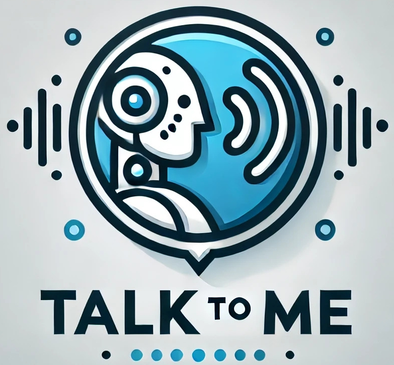

    <picture>
        
    </picture>
     
     

Talk To Me is a project that captures human speech from a microphone, converts it to text for an LLM, and plays the audio of the response text. It is not meant to be a chatbot, but a interface for verbal communication with robots or programs.

